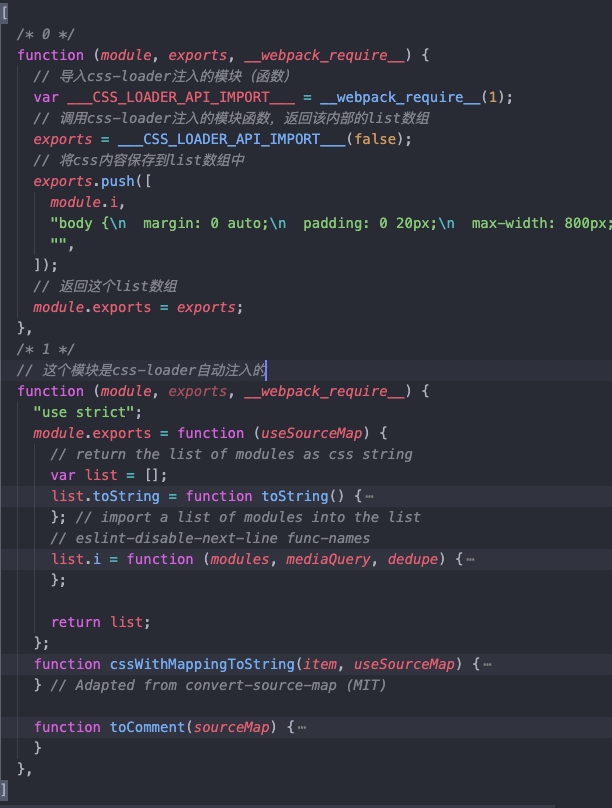

# webpack 资源模块加载

- webpack 不仅仅是 JavaScript 模块化打包工具，它是整个前端项目/工程的模块打包工具，可以通过 webpack 去引入打包工程中的任意文件（css 文件，图片文件，字体文件等）

- webpack 的打包入口不仅可以设置为 js 文件，也可以设置为其它资源，比如本例中以`.src/main.css`作为打包入口。（tips: 通常 webpack 打包都是使用 js 文件作为打包入口，因为现代前端应用都是通过 JavaScript 来驱动整个应用业务的）

- 在不配置 css loader 的情况下打包 css 文件，控制台会提示`Module parse failed`的错误，并提示需要配置对应的 loader 来处理 css 文件。 这是因为 webpack 会默认将所有文件当作 js 语法来解析，所以 css 语法不能被解析成功。（tips: 我们可以尝试在 css 文件中书写一段 js 脚本，然后再次打包，可发现打包通过）

- 为了让 css 文件能够被 webpack 处理，可以安装`css-loader`并在 webpack.config.js 中配置。css-loader 可以将 css 文件转成 js 模块。

- `css-loader` 将 css 文件内容，保存到 css-loader 模块内部的数组`list`中，然后返回了这个数组。

- css-loader 将只是将 css 文件转换为 js 模块并保存在内存中，为了让 css 内容在页面展示出来，可以添加并配置`style-loader`来将 css 内容插入到 html 中

- style-loader 的核心原理：读取 css-loader 保存的 css 内容，调用`addStyle` -> `insertStyleElement` 将 css 通过 style 标签的形式插入到页面中

- 当使用多个 loader 处理文件时，webpack 的 loader 执行流程是**从后往前**调用执行，需要将先处理的 loader 写在后面，比如本例中将 css-loader 写在最后，webpack 执行时，先通过 css-loader 处理后，再交给 style-loader 处理

- `loader`是 webpack 实现模块化的核心特性，通过不同的 loader 去实现任何类型资源的加载
